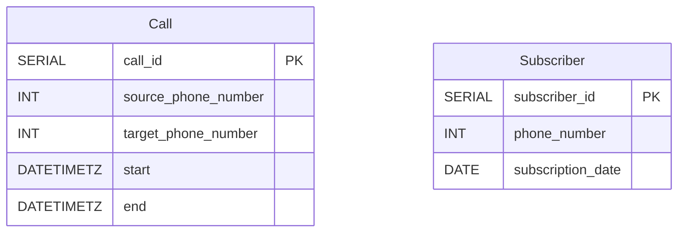
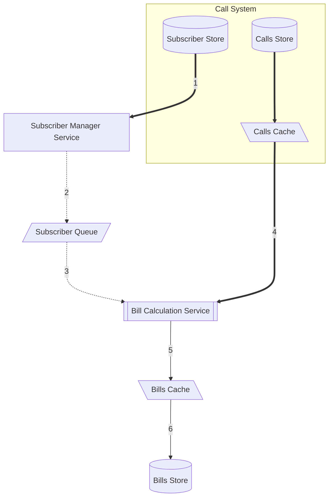
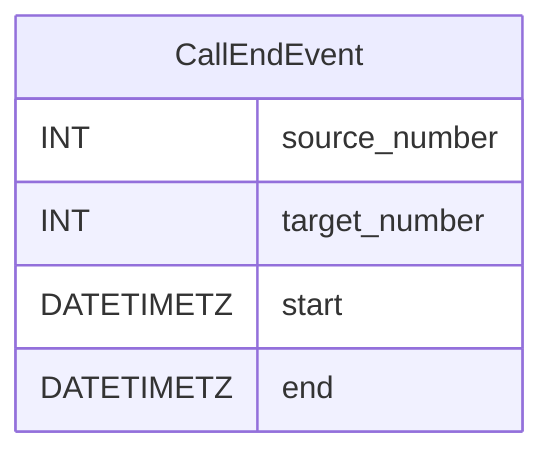
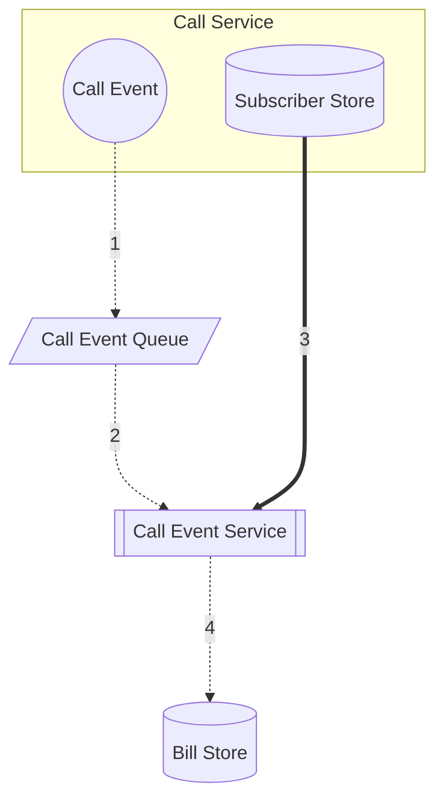

# Phone company billing system

A system that tracks phone calls made by susbcriber and creates billing for them monthly.

## Requirements

### Functional

1. Track start and end timestamp of every phone conversation.
1. track the source and target of every phone conversation.
1. Create monthly bills for the users.
1. Staggered billing, if the user subscribes on 7th, they get their bill on 7th every month.
1. Scope of the system of North America
1. Users cannot place calls if they have overdue bills

### Nonfunctional

#### Durable

The bills should persist once they are created.

#### Reliable

The system should reliably create the bills with the expected amounts.

#### Available

The system should be able to provide bills on demand at anytime.
The system should be available to notify the call system for overdue bills before each call is connected during any time of the day.

#### Scalable

The system should be able to handle millions of calls starting at ending, with unpredictable peaks in usage.

#### Secure

Each bill should only be available to the respective subscriber and no one else.

## High Level Design

The system is basically the infrastructure for a massive data transformation algorithm that takes in the call logs and outputs the billing statements.

We shall assume the following call log entity:

### As a batch processing system

If we design the system to run in a daily batch mode, the system may look like this:

### As an event based system

In this architecture, we will assume that the calls system emits events when a call ends.

The structure of a `CallEndEvent` may look like this:

The system is responsible for queuing an update for the respective subscriber's running bill in accordance with the event.

