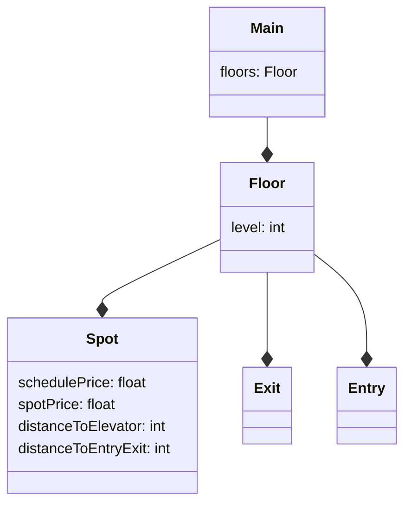

# High Level Class Diagram

```mermaid

classDiagram
    class Spot {
        schedulePrice: float
        spotPrice: float
        distanceToElevator: int
        distanceToEntryExit: int
    }
    class Floor {
        level: int
    }
    class Main {
        floors: Floor
    }
    Exit
    Entry

    Main --* Floor
    Floor --* Spot
    
    Floor --* Exit
    Floor --* Entry
```
