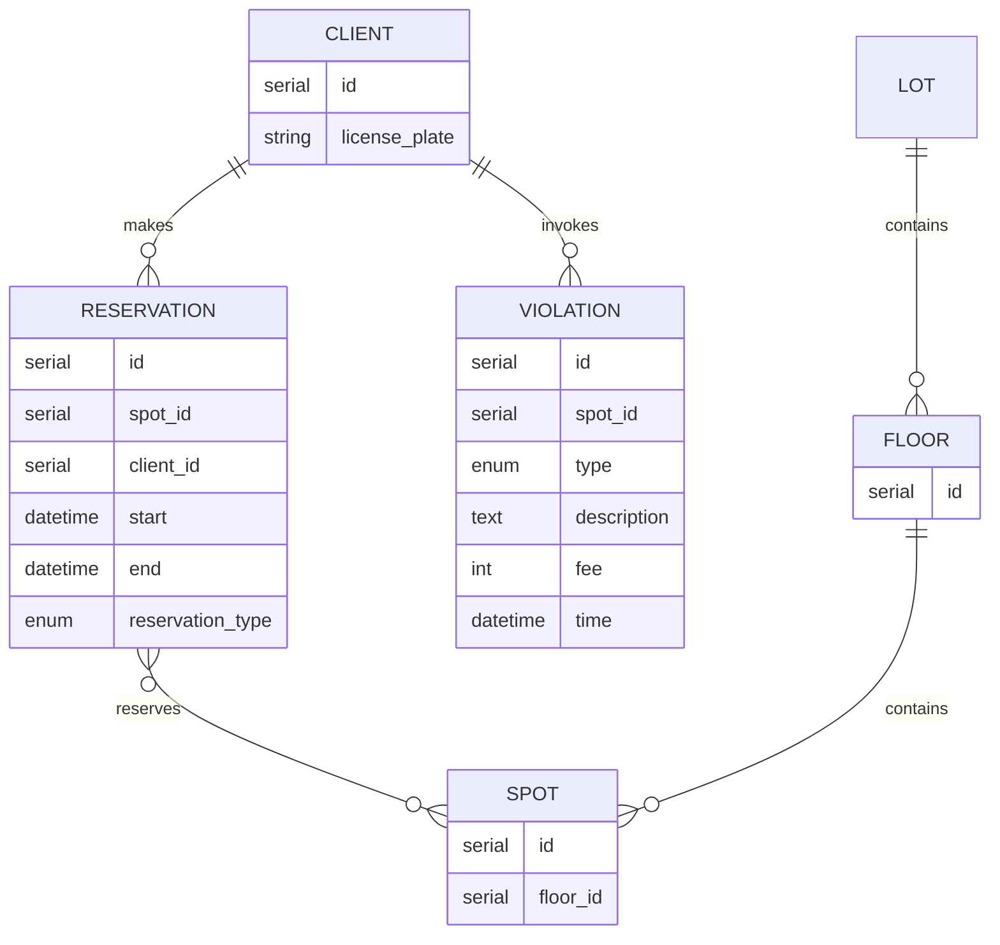

# Entities

```mermaid
erDiagram
    SPOT {
        serial id
        serial floor_id
    }

    FLOOR {
        serial id
    }

    RESERVATION {
        serial id
        serial spot_id
        serial client_id
        datetime start
        datetime end

        %%Such as recurring, or one type reservation%%
        enum reservation_type 
    }

    VIOLATION {
        serial id 
        serial spot_id
        %% overstay, damage %%
        enum type 
        text description
        int fee
        datetime time
    }

    CLIENT {
        serial id
        string license_plate
    }


    RESERVATION }o--o{ SPOT : reserves

    FLOOR ||--o{ SPOT : contains
    LOT ||--o{ FLOOR : contains
    CLIENT ||--o{ RESERVATION: makes
    CLIENT ||--o{ VIOLATION : invokes
```
