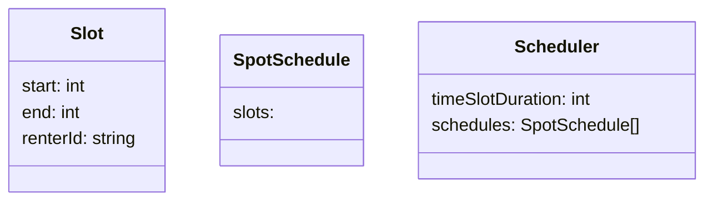

# Scheduling

Spots can be rented or be on spot market.



## Spot reservation

1. Request all spots that are available for a certain time period
2. After user chooses a spot, save the start and end times for the spot

```mermaid
graph
    
    
```
