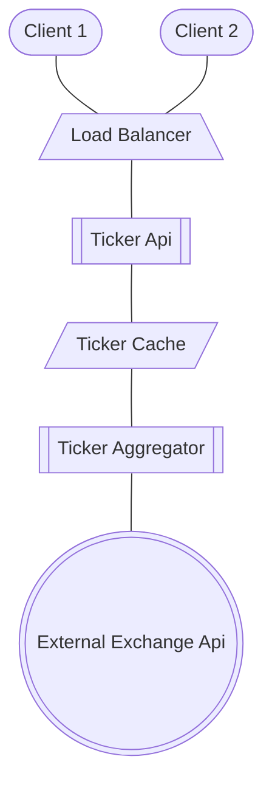

# Robinhood High Level

Robinhood is a market aggregator. Its value proposition is offering retail investors and easy-to-understand interface with the market.

It aggregates market values in a way that is preferable for its clients and the business.

## Features

### Functional

1. Clients can send orders
1. Clients need to have access to their positions.
1. Clients need to have access to up-to-date information about the current market.

### Nonfunctional

1. System needs to be highly available
1. System needs to be fast
1. System needs to be reliable

### Main concerns

1. Providing up to date information to all clients about the current market conditions.

## High level design

