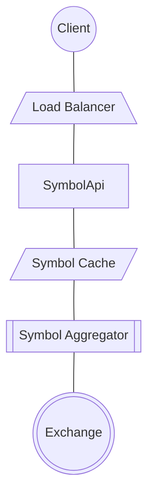

# Securities market aggregator system design

## Requirements

### Functional

1. Send orders
1. View positions
1. View up-to-date prices of securities

### Nonfunctional

1. 5-9's availability
1. < 100ms response time when the symbols change in partner exhanges.
1. Durable
1. Reliable

## High Level Design

This graph focuses on providing clients with up-to-date symbol price information. By SLA, the updates need to reach the client in less than 100ms in 99th percentile

### Symbol Aggregator

Gets symbol prices and sorts them in order to retrieve the price that is most profitable for the client and platform.

It will receive prices from a list of exchanges that it is connected to and will sort the prices and report them to the higher levels.

### Symbol Cache

Holds the latest price for clients to read, Which may look something like

- BTC: 67000
- AAPL: 20
- MSFT: 200

### SymbolApi

Responsible as being the backend for the clients that provides the latest symbol values.
