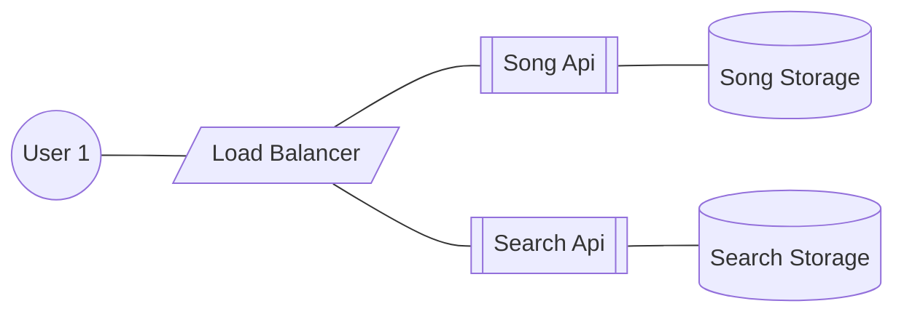

# Spotify High-Level Design

### Legend

User1: Some client on web or some other kind of environment
LB: Load balancer for ingress

SongApi: Feeds the user with the song binaries to be played.
SongStorage: Stores songs as binaries, preferably allows partial retirevals

SearchApi: Provides user with search results for songs, this will use song metadata to handle searches
SearchStorage: Stores song metadatas so that searches can be carried against them.
