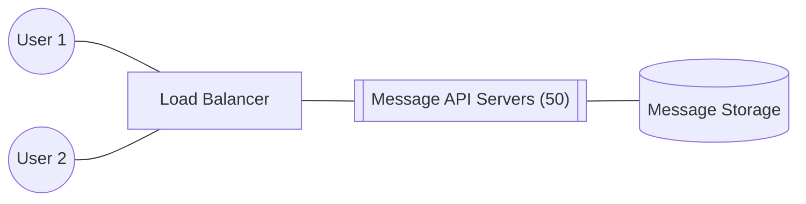
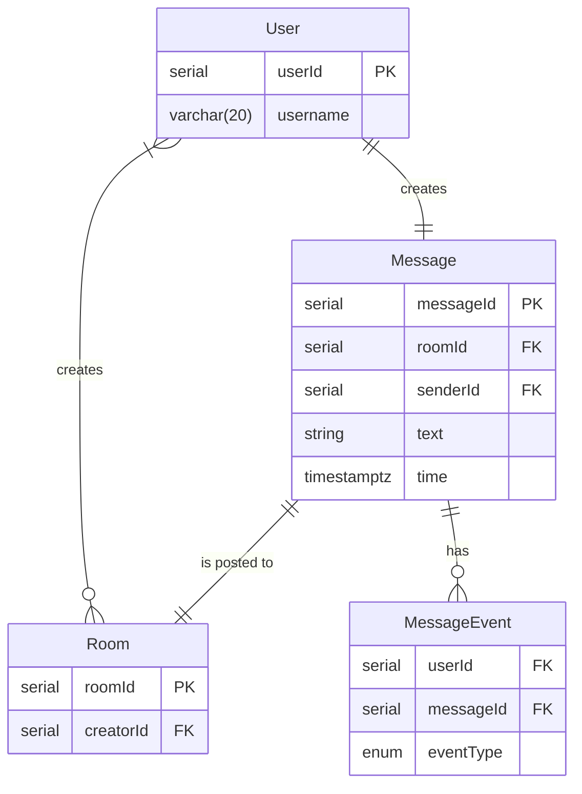

# Telegram Messaging High-Level Design

```mermaid
graph LR 
    User1((User 1))
    User2((User 2))
    LB["Load Balancer"]
    MessageApi[["Message API Servers (50)"]]
    MessageDB[("Message Storage")]

    User1 --- LB
    User2 --- LB

    LB --- MessageApi --- MessageDB
```

## Entity Design

```mermaid
erDiagram 
    Message {
        serial messageId PK
        serial roomId FK
        serial senderId FK
        string text
        timestamptz time
    }

    User {
        serial userId PK
        varchar(20) username
    }

    Room {
        serial roomId PK
        serial creatorId FK
    }

    MessageEvent {
        serial userId FK
        serial messageId FK
        %% Sent, Read, etc
        enum eventType 
    }

    User ||--|| Message : creates
    Message ||--|| Room : "is posted to"
    User }|--o{ Room : creates
     
    Message ||--o{ MessageEvent : has
```
