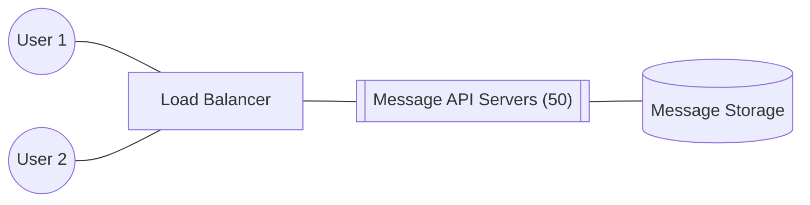
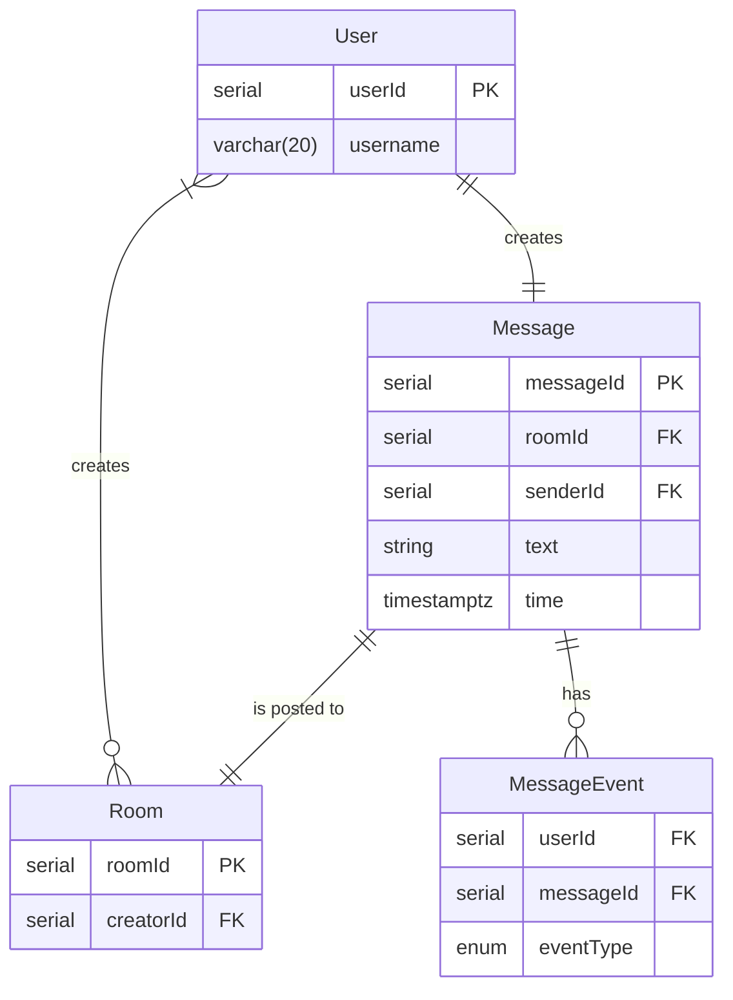

# Telegram Messaging High-Level Design

## Entity Design

## Message sending

1. Client 1 sends a message to Client 2
2. MessageApi1 Receives the message
3. MessageApi1 saves the message to storage
4. MessageApi1 saves the message received event to storage
5. MessageApi2, where Client2 is connected to is subscribed to MessageReceived event on the cache, it receives the update and pulls the message from message storage
5. MessageApi2 sends the message to Client2

There needs to be a background job that checks MessageReceived and other similar events to make sure that no message remains unsent.
