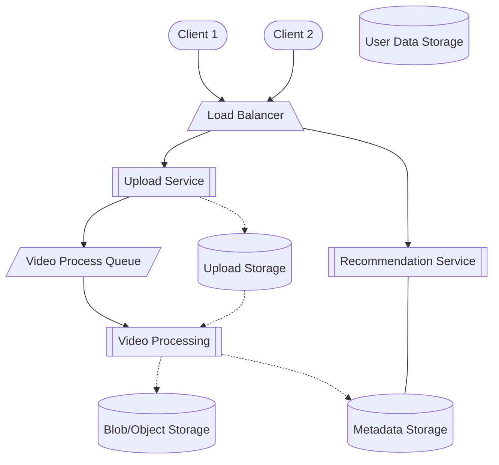

# TikTok

## High level component diagram

```mermaid
graph TB
    Client1([Client 1])
    Client2([Client 2])
    LB[/Load Balancer\]
    UploadSvc[[Upload Service]]
    RecommendationSvc[[Recommendation Service]]
    MetadataStr[(Metadata Storage)]
    BlobStr[(Blob/Object Storage)]
    UploadStr[(Upload Storage)]
    VideoProcessing[[Video Processing]]
    VpQueue[/Video Process Queue/]
    UserDataStr[(User Data Storage)]

    Client1 --> LB
    Client2 --> LB

    LB --> UploadSvc
    LB --> RecommendationSvc

    UploadSvc --> VpQueue
    UploadSvc .-> UploadStr
    VpQueue --> VideoProcessing 
    UploadStr .-> VideoProcessing 
    VideoProcessing .-> BlobStr
    VideoProcessing .-> MetadataStr
    
    RecommendationSvc <--- MetadataStr


    

```
