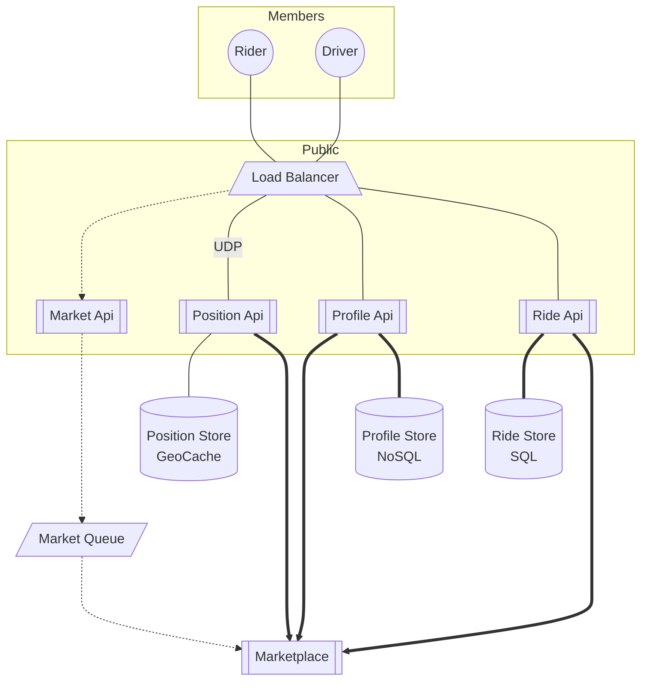

# Uber Ride Sharing

Uber maintains a marketplace where riders and drivers can match depending on distance and other factors.

## Requirements

### Functional

Not all of these will be included in the MVP.

#### Riders

1. Riders see a list of drivers nearby.
1. Riders book trips.
    1. Can book trips in the future.
    1. Can change trips before and mid-ride.
    1. Can cancel trips before and mid-ride.
1. Riders and Drivers can see their past journeys.
1. Riders and drivers are given alternative routes before the trip begins.
1. Riders and drivers can rate each other.

#### Drivers

1. One of the fundamental objectives of the platform is to keep the drivers busy.
1. Drivers can accept or decline a request by a rider.
1. Drivers can set different statuses such as "available", "busy"
1. Drivers can set vehicle types, which is a factor in the marketplace that the riders may consider.
1. Drivers can offer different kinds of rides:
    1. Shared rides
    1. Pets
    1. ...etc

#### Both

1. The fee is calculated pre-trip and is offered to both riders and drivers during the match.

### Nonfunctional

#### Available

System has 5-9's availability

#### Durable

Past journeys are available to riders and drivers irrespective of when the trip took place.

#### Secure

The data bleonging to riders and drivers can only be seen by themselves. No private data is available to anyone else.

#### Reliable

The system always produces predictable fees on predictable routes and traffic loads.

#### Scalable

The system is able to adapt to the changes in demand without any disturbance in availability.

## Design

### Basic journey

1. User opens their app, puts in a source and target location for their journey.
1. User is provided with a list of services available in the area:
    1. Single
    2. Shared
    3. Pets
    4. etc
1. System finds a driver that matches the service type the user wants. The driver selection would be made among the following statuses:
    1. Available drivers that aren't busy
    1. Drivers that are currently busy but approaching the end of their journey.
Drivers may be sorted using criteria that may include:
    1. The closest
    1. The driver that has been sitting idle for the longest time
    1. The driver that has made the least amount of money that month.
1. If the driver accepts, the ride contract is established between the rider and the driver. If not, the system notifies the next driver in the list.

### High Level Architecture

