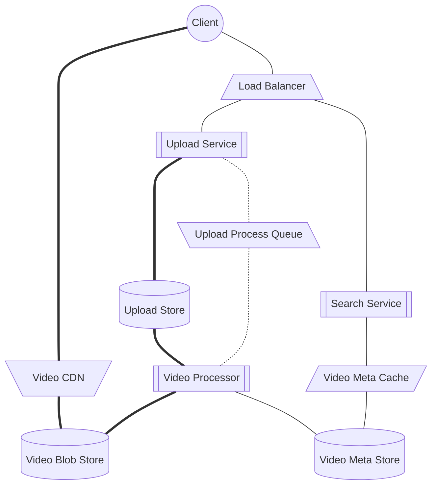

# Youtube System Design

## Requirements

### Functional

#### In focus

1. Upload videos
1. Watch videos
1. Search videos

#### Out of focus

1. Reactions
1. video-attached content (comments)
1. Authentication & Authorization

### Nonfunctional

1. 5-9's availability globally
1. Reliable: Uploaded videos stay uploaded
1. Scalable: Handles uneven traffic and peaks
1. Globally Responsive: < 100ms RT @ 99%

## High Level Design

This design only focuses on video upload and viewing related apis and components.

